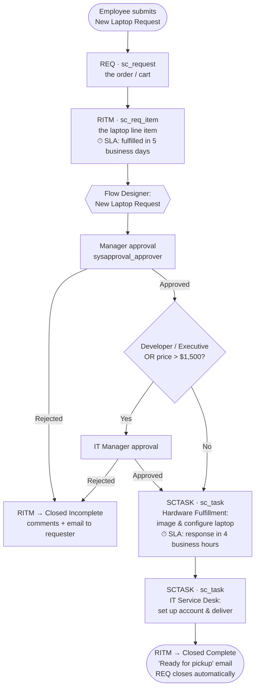

# ServiceNow ITSM Lab — Laptop Request, Approvals, SLAs & Knowledge

**Project page:** https://harmanbir55-glitch.github.io/ServiceNow-Webpage/

A small but complete IT Service Management configuration built in a ServiceNow **Personal Developer Instance (PDI)**, modeled on a fictional retailer, **NorthPeak Home Supply** (one head office, two stores).

I've used ServiceNow every day as a **fulfiller** on a retail service desk (96% SLA compliance, 78% FCR). This project is the other side: configuring the platform as an **admin**.

> Release: built on the **Australia** release PDI (Q2 2026). Navigation paths may differ slightly on other releases; differences are flagged in the build guide.
> All people, companies and data are fictional.

---

## What it does

An employee requests a new laptop in the Service Portal. The request is priced, approved by the right people, fulfilled by two teams, measured against SLAs, and supported by self-service knowledge.



| Record | Table | Number | What it represents |
|---|---|---|---|
| Request | `sc_request` | REQ0010001 | The order (the cart), one per checkout |
| Requested Item | `sc_req_item` | RITM0010001 | One catalog item in that order, with its variables |
| Catalog Task | `sc_task` | SCTASK0010001 | A unit of work for one fulfillment group |
| Approval | `sysapproval_approver` | — | One approver's decision on the RITM |
| Task SLA | `task_sla` | — | A running SLA timer attached to a task |

All three task tables extend `task`, which is why they share Number, State, Assignment group, Work notes and SLAs.

## What was built

| Area | Configuration |
|---|---|
| **Foundations** | Company, 3 locations, 5 departments, cost center, 4 groups with role-based access, 12 users with a manager hierarchy, update set discipline |
| **Service Catalog** | *New Laptop Request* item (7 variables, pricing per model and accessory), reusable **Requester Info** variable set shared with a second item, 2 catalog UI policies, 1 catalog client script |
| **Flow Designer** | Conditional 1- or 2-level approval, rejection handling, two sequential catalog tasks, auto-close |
| **Notifications** | Submitted, approval requested, approved/rejected, ready for pickup (email script prints the variables) |
| **SLAs** | Business-hours schedule (Mon–Fri 9–5 Pacific + holidays); RITM fulfillment, SCTASK response, and 24x7 P1 incident resolution to contrast schedules |
| **Knowledge** | *IT Self-Service* KB with approval publishing, user criteria, 5 end-user articles, versioning and retirement |
| **Reporting** | 4 reports and an IT Manager dashboard |
| **Platform** | Custom field `u_asset_tag` on `sc_task`, field-level ACL, business rule, import set + transform map with coalesce (20 laptop assets), update set export/import to a second instance |

## Break/fix scenarios

Each is written up like a ticket: symptoms, diagnosis, root cause, fix, prevention.

| # | Scenario | Write-up |
|---|---|---|
| 1 | Flow never triggers | [troubleshooting/01](troubleshooting/01-flow-never-triggers.md) |
| 2 | Approval routed to no one (requester has no manager) | [troubleshooting/02](troubleshooting/02-approval-routed-to-no-one.md) |
| 3 | Variable hidden by a conflicting UI policy | [troubleshooting/03](troubleshooting/03-conflicting-ui-policy.md) |
| 4 | SLA never starts / never pauses | [troubleshooting/04](troubleshooting/04-sla-not-starting-or-pausing.md) |
| 5 | User can't see a KB article (user criteria) | [troubleshooting/05](troubleshooting/05-kb-article-not-visible.md) |
| 6 | Import creates duplicates (no coalesce) | [troubleshooting/06](troubleshooting/06-import-duplicates-no-coalesce.md) |

## Skills demonstrated

- **Platform administration:** users, groups, roles, companies, locations, departments; list/form configuration vs personalization; application navigator
- **Service Catalog:** catalog items, variables, variable sets, catalog UI policies, catalog client scripts, pricing, REQ/RITM/SCTASK data model
- **Automation:** Flow Designer (Service Catalog trigger, Ask for Approval, If/Else, Create Catalog Task, Update Record), email notifications and mail scripts, business rules
- **Service levels:** schedules, SLA definitions, start/pause/stop/cancel conditions, retroactive start, SLA reporting
- **Knowledge management:** knowledge bases, publishing workflows, user criteria, categories, versioning, retirement, attaching knowledge to tasks
- **Data & security:** dictionary, custom fields, ACLs and evaluation order, import sets, transform maps, coalesce
- **Delivery practice:** update sets, XML export/import between instances, Git-based backup
- **Testing:** impersonation of every persona, reading Flow Designer execution details

## Repository layout

```text
.
├── README.md
├── docs/
│   └── build-guide.md            # Phase-by-phase build with navigation paths and the "why"
├── config/                       # Source for every script and template in the instance
│   ├── client-scripts/  business-rules/  acls/
│   └── transform-maps/  notifications/   flows/
├── data/                         # Users and 20 laptop assets (import set source)
├── kb/                           # Knowledge article text
└── troubleshooting/              # Break/fix write-ups
```

## Reproduce it

1. Request a free PDI at the ServiceNow Developer Program.
2. Follow [docs/build-guide.md](docs/build-guide.md) and load [/data](data) with import sets.

## Author

**Harmanbir Kaur** · Service Desk Analyst · Microsoft Certified: Azure Fundamentals
[LinkedIn](https://www.linkedin.com/in/harmanbir05/) · [GitHub](https://github.com/harmanbir55-glitch) · [Portfolio](https://github.com/harmanbir55-glitch/Portfolio) · Related project: [AssetTrack](https://github.com/harmanbir55-glitch/Assettracker)
